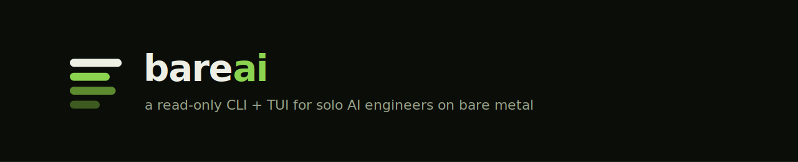

<p align="center">
  <picture>
    <source media="(prefers-color-scheme: dark)" srcset="branding/readme-header-dark.svg">
    <source media="(prefers-color-scheme: light)" srcset="branding/readme-header-light.svg">
    
  </picture>
</p>

<p align="center">
  <a href="https://github.com/baselhusam/bareai-cli/actions/workflows/ci.yml"></a>
  <a href="https://github.com/baselhusam/bareai-cli/releases/latest"></a>
  <a href="https://pkg.go.dev/github.com/baselhusam/bareai-cli"></a>
  <a href="LICENSE"></a>
  
  
</p>

<p align="center">
  <strong>CLI + TUI for solo AI engineers inspecting bare-metal AI infrastructure.</strong><br>
  <sub>Host · GPU · Docker · LLM · DB — correlated, read-only, scriptable.</sub>
</p>

<p align="center">
  <a href="https://baselhusam.github.io/bareai-cli/">Website</a> ·
  <a href="#install">Install</a> ·
  <a href="#quick-start">Quick start</a> ·
  <a href="#commands">Commands</a> ·
  <a href="docs/">Docs</a> ·
  <a href="ROADMAP.md">Roadmap</a>
</p>

---

`bareai` answers one question on a single machine: *what is this box doing right now?*

It collects host resources, GPUs, Docker, local LLM runtimes (Ollama, vLLM, SGLang, Triton, …), and local databases, correlates them, and presents the result as human tables, JSON, or a live terminal dashboard.

| | |
|---|---|
| **Mode** | Inspect / probe only — no stop, restart, deploy, or other mutating ops |
| **Persona** | One engineer, one machine (SSH or local) |
| **Platforms** | Linux, macOS, Windows |
| **GPUs** | NVIDIA, AMD, Apple Silicon (degrades gracefully when absent) |
| **Output** | CLI tables · live TUI · `--json` for scripts and agents |

Collectors are optional: missing Docker, GPU drivers, or LLM runtimes degrade gracefully. Commands still exit `0` and record a `skipped` reason.

```
Host + GPU + Docker + LLM + DB  →  Snapshot  →  CLI / TUI / JSON
```

---

## Install

```bash
# macOS / Linux
curl -fsSL https://raw.githubusercontent.com/baselhusam/bareai-cli/main/scripts/install.sh | bash

# Homebrew
brew tap baselhusam/tap && brew install bareai

# Windows (winget)
winget install baselhusam.bareai
```

More options (APT, PowerShell, completions, build from source): **[docs/install.md](docs/install.md)**

---

## Quick start

```bash
bareai status                 # one-screen summary
bareai inspect                # full correlated report
bareai inspect --json | jq .  # machine-readable snapshot
bareai doctor --share         # paste-friendly report for issues/chat
```

On a TTY, bare `bareai` launches the dashboard. In pipes/CI it prints help; `bareai watch` falls back to `status`.

---

## Commands

| Command | Purpose |
|---------|---------|
| *(none)* / `watch` | Live TUI dashboard |
| `status` | Host + infrastructure summary |
| `gpu` | GPU inventory and metrics |
| `docker` | Containers, images, volumes |
| `llm` | Discovered inference servers |
| `db` | Local databases (Postgres, Redis, Mongo, …) |
| `probe` | One-hit smoke tests |
| `inspect` | Full correlated report |
| `doctor` | Ranked diagnostics (read-only hints) |
| `config path` | Resolved config file path |
| `version` | Build metadata |
| `completion` | Shell completions |

Full reference with flags and examples: **[docs/commands.md](docs/commands.md)**

---

## Website

Product landing (GitHub Pages): **[baselhusam.github.io/bareai-cli](https://baselhusam.github.io/bareai-cli/)** — source in [`docs/site/`](docs/site/).

Enable under **Settings → Pages**: Deploy from a branch → **main** → **/docs**.

## Documentation

| Guide | |
|-------|--|
| [Install](docs/install.md) | Scripts, Homebrew, winget, APT |
| [Configuration](docs/configuration.md) | Config YAML, flags, env vars |
| [Commands](docs/commands.md) | CLI reference |
| [Interactive TUI](docs/tui.md) | Tabs and keybindings |
| [JSON & snapshot](docs/json.md) | `--json` output model |
| [Platforms](docs/platforms.md) | Linux / macOS / Windows matrix |
| [Workflows](docs/workflows.md) | Common recipes |
| [Development](docs/development.md) | Build, test, lint |
| [Branding](docs/branding.md) | Logos and palette |
| [Roadmap](ROADMAP.md) | Phases and status |

---

## License

MIT — see [LICENSE](LICENSE).
