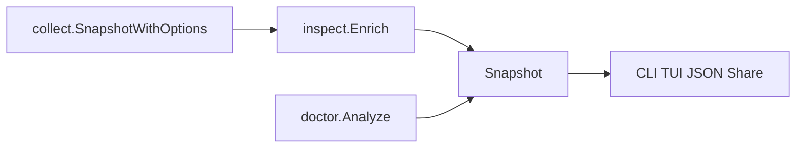
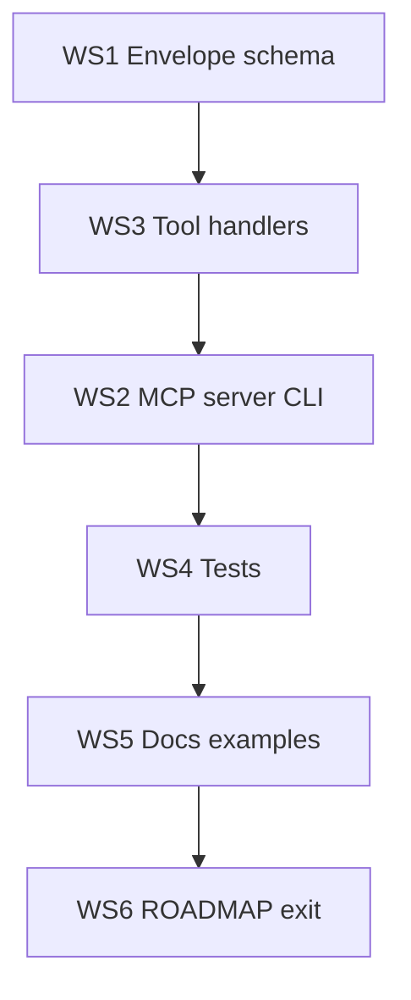

# Phase 11 — Agent eyes (implementation plan)

**Goal:** Coding agents and scripts treat bareai as ground truth for the box — not `nvidia-smi` + `docker ps` + curl. Phase 10 made the cockpit addictive; Phase 11 makes uninstall painful for agents.

**Explicitly out of scope:** Prometheus metrics export (stays in ROADMAP backlog).

---

## Current foundation (Phase 10 done)



Reuse these packages — **no parallel discovery in MCP**:

| Package | Role |
|---------|------|
| `internal/collect/collect.go` | `FullOptions()` / `LightRefreshOptions()` |
| `internal/inspect/build.go` | `Enrich` → correlations + inspect findings |
| `internal/doctor/doctor.go` | `Analyze` → ranked doctor findings |
| `internal/probe` | One-hit smoke tests |
| `internal/snapshot/snapshot.go` | Shared types |
| `internal/render/json.go` | JSON encoder |

Phase 10 additions agents will rely on: `correlations[].kind`, `databases[]`, theater rows, `doctor --share` layout as reference for human summaries.

---

## Design locks

1. **Official MCP SDK.** Use `github.com/modelcontextprotocol/go-sdk/mcp` (canonical, stdio-first). Pin a stable release (e.g. `v1.6.x`) in `go.mod`.
2. **Stdio transport only in Phase 11.** `bareai mcp` speaks MCP over stdin/stdout — Cursor, Claude Desktop, and CLI subprocess patterns. HTTP/SSE transport deferred to backlog.
3. **Six tools, one brain.** Each tool wraps existing Go APIs; handlers never shell out to `bareai` subprocess (in-process only).
4. **Versioned agent envelope.** Every tool JSON response includes metadata alongside payload:

```json
{
  "schema_version": "1.0",
  "bareai_version": "0.x.y",
  "collected_at": "2026-07-22T12:00:00Z",
  "data": { }
}
```

5. **Read-only.** All MCP tools are inspect/probe only — same product boundary as CLI.
6. **Timeouts from config.** Respect `config.Defaults.Timeout` (overridable per tool call via optional `timeout_seconds` arg, capped at 120s).
7. **Errors degrade, don't die.** Return MCP tool errors with structured `skipped` reasons when collectors fail; never crash the server process.

---

## MCP tool surface (locked)

| Tool | Maps to | Input | Output `data` |
|------|---------|-------|---------------|
| `bareai_snapshot` | `inspect` | `{ "light": bool }` optional | Full enriched `Snapshot` |
| `bareai_correlations` | `inspect.Enrich` → correlations | none | `{ "correlations": [...] }` |
| `bareai_llms` | `llm` collector | `{ "list_models": bool }` default true | `{ "llms": [...] }` |
| `bareai_databases` | `db` collector | none | `{ "databases": [...] }` |
| `bareai_doctor` | `doctor` | `{ "min_severity": "info\|warn\|critical" }` | `{ "findings": [...], "counts": {...} }` |
| `bareai_probe` | `probe` | `{ "endpoint", "runtime", "model", "prompt" }` all optional | `{ "llms": [...] }` with probe results |

**When agents should use each tool:**

- **`bareai_snapshot`** — “What is on this box?” Default first call.
- **`bareai_correlations`** — “Which model runs on which GPU/container?” Lightweight join-only query.
- **`bareai_llms` / `bareai_databases`** — Focused panes without full snapshot cost.
- **`bareai_doctor`** — “What's wrong and what should I try?” Ranked diagnostics.
- **`bareai_probe`** — “Is inference actually working?” One-hit smoke test.

No separate GPU/host/docker tools in Phase 11 — they live inside `bareai_snapshot` to avoid tool sprawl.

---

## Package layout

```
internal/mcp/
  server.go       # NewServer(), RunStdio(ctx)
  tools.go        # registerTools(server), handler funcs
  envelope.go     # AgentEnvelope, schema_version constant
  collect.go      # shared collect+enrich helper (FullOptions vs light)
internal/cli/mcp.go
  bareai mcp      # cobra command; stdio transport
docs/agents.md    # agent contract, tool catalog, Cursor/Claude config
examples/
  cursor-mcp.json
  claude-desktop-config.json
  agent-shell.sh  # jq recipes without MCP
```

Register in `internal/cli/root.go`: `mcpCmd` alongside existing commands.

---

## Workstream 1 — Agent envelope + schema contract

**Files:** `internal/mcp/envelope.go`, `docs/agents.md`, `docs/json.md`

- Define `const SchemaVersion = "1.0"`.
- Add `AgentEnvelope` wrapper used by all MCP tool responses.
- Document field stability rules:
  - **Stable:** top-level Snapshot fields, `correlations[].kind`, finding `id`/`severity`/`summary`/`try`
  - **May grow:** new optional JSON fields (never rename/remove without schema bump)
  - **Skip reasons:** always present in `skipped[]` when collectors fail
- Add schema changelog section in `docs/agents.md`.

**Optional (small):** add `"schema_version"` to `bareai inspect --json` output for parity — same constant, additive field only.

---

## Workstream 2 — MCP server + stdio command

**Files:** `internal/mcp/server.go`, `internal/cli/mcp.go`

- `bareai mcp` — long-running process; logs to **stderr only** (never pollute stdout MCP stream).
- Server metadata: `Name: "bareai"`, `Version: version.Version`.
- Use SDK stdio transport.
- Graceful shutdown on context cancel / SIGTERM.

**Cursor config example** (`examples/cursor-mcp.json`):

```json
{
  "mcpServers": {
    "bareai": {
      "command": "bareai",
      "args": ["mcp"]
    }
  }
}
```

---

## Workstream 3 — Tool handlers (single brain)

**Files:** `internal/mcp/tools.go`, `internal/mcp/collect.go`

Shared helper:

```go
func collectEnriched(ctx context.Context, light bool) (*snapshot.Snapshot, error)
```

- `light=false` → `collect.FullOptions()` + `inspect.Enrich`
- `light=true` → `collect.LightRefreshOptions()` + enrich

| Tool | Collect path |
|------|--------------|
| `bareai_snapshot` | Full or light per arg; full enrich |
| `bareai_correlations` | Light collect + enrich; return correlations only |
| `bareai_llms` | Full LLM options; respect `list_models` |
| `bareai_databases` | `ProbeDB: true` |
| `bareai_doctor` | Full collect + enrich + `doctor.Analyze` with severity filter |
| `bareai_probe` | Reuse probe package; extract shared runner from CLI if needed |

---

## Workstream 4 — Tests

| Test | File | Covers |
|------|------|--------|
| Envelope shape | `internal/mcp/envelope_test.go` | schema_version, bareai_version, collected_at |
| Tool handlers | `internal/mcp/tools_test.go` | fixture snapshot → JSON shape per tool |
| Collect helper | `internal/mcp/collect_test.go` | light vs full options wiring |
| CLI smoke | `internal/cli/mcp_test.go` | `bareai mcp --help`, command registered |

Optional integration test (build tag `integration`): spawn `bareai mcp`, send MCP initialize + `tools/list` over stdio.

---

## Workstream 5 — Agent-oriented docs + examples

**Files:** `docs/agents.md` (new), `README.md`, `docs/commands.md`, `docs/workflows.md`, `.cursor/rules/architecture.mdc`

Content:

1. When agents should call bareai vs raw shell (decision table).
2. Tool catalog with input/output JSON examples.
3. Cursor MCP setup — copy-paste config.
4. Claude Desktop config snippet.
5. Shell fallback — `bareai inspect --json`, `bareai doctor --json` for CI/scripts without MCP.
6. Prompt snippets for agents: “Use bareai_snapshot before suggesting GPU/container changes.”

Update architecture rule: `internal/mcp` is a view layer like TUI/render — must call collect/inspect/doctor, not re-implement.

Man pages: add `bareai-mcp.1` via existing `docs/man/gen.go` pattern.

---

## Workstream 6 — ROADMAP exit

Update `ROADMAP.md` Phase 11 checkboxes when exit criteria met.

---

## Suggested implementation order



1. WS1 envelope + shared collect helper
2. WS3 tool handlers (unit-testable without stdio)
3. WS2 wire MCP server + `bareai mcp`
4. WS4 tests
5. WS5 docs + examples
6. WS6 ROADMAP checkboxes

---

## Exit criteria (Phase 11 done)

- [ ] `bareai mcp` runs stdio MCP server using official go-sdk
- [ ] Six tools implemented; all call collect/inspect/doctor/probe in-process
- [ ] Responses use `schema_version` + `bareai_version` envelope
- [ ] `docs/agents.md` documents contract, tools, Cursor/Claude setup
- [ ] Examples in `examples/` work with documented config
- [ ] Tests cover envelope + each tool handler + CLI registration
- [ ] Architecture rule: MCP is a view, not a second brain
- [ ] ROADMAP Phase 11 checked off

**Deferred:** Prometheus export, HTTP/SSE MCP transport, MCP resources (vs tools), fleet/multi-host.
